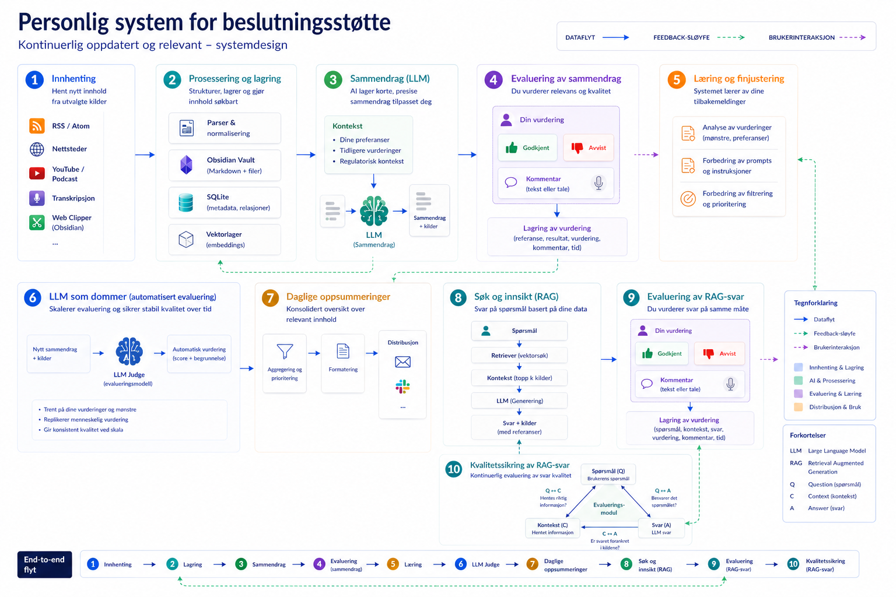

# PERSONLIG SYSTEM FOR BESLUTNINGSSTØTTE

## Bakgrunn

En beslutninigstaker jobber med informasjon hele dagen. E-poster, møtereferater, rapporter, chat og beslutningsnotater strømmer inn fra mange hold. Det meste er relevant for noen, men sjelden alt relevant for deg. Å finne det som faktisk er viktig for dine beslutninigner tar mye tid.

Denne løsningen strukturerer og effektiviserer den prosessen med en full-stack AI-løsning skrevet i Python. I denne implementeringen er domenet et annet: Min daglige rolle i krysniningspunktet AI solution Engineer og Business Controller krever løpende oversikt over fagblogger, forskningsartikler, nyhetsbrev og teknologipublikasjoner. Volumet er høyt og tempoet er raskt. Systemet er det samme jeg ville brukt i rendyrket rolle som Business Controller, men her er kildene byttet ut for å vise at systemet er generelt og kan tilpasset et valgt domene eller rolle

---

###### (Illustrasjon: ChatGPT Images 2.0)
---

## Hvordan fungerer det?

Tenk deg at du abonnerer på 20 fagblogger og nyhetsbrev. Hver dag publiseres det kanskje 30 nye artikler på tvers av kildene. Du har tid til å lese fem. Hvordan oppdaterer du deg på de resterende 25? Hver dag.

Systemet henter artiklene automatisk, leser dem og destillerer innholdet til strukturerte sammendrag tilpasset brukerens preferanser og informasjonsbehov. Sammendragene kobler innholdet til regulatorisk kontekst der det er relevant, som AI Act, NIS2 og ISO 42001. Til slutt leveres alt samlet i en daglig e-post.

Over tid lærer systemet hva du finner nyttig. Det skjer gjennom en innebygd vurderingsmekanisme: du godkjenner eller avviser sammendrag med en kort kommentar, og systemet bruker disse tilbakemeldingene til å stille inn seg selv på akkurat din måte å tenke på.

I denne versjonen følger systemet kurerte AI- og teknologikilder. Det er domenet jeg trenger oversikt over i det daglige, hvor jeg hjelper bedrifter med å skape skalerbar tillit og verdi med AI.

---

## Potensialet for andre domener og roller

Arkitekturen er ikke låst til ett fagfelt. Det som i dag leser AI-blogger kan like gjerne settes til å følge bransjenyhetsbrev, interne kunnskapskilder, konkurranserapporter eller juridiske endringer. Personaliseringen vokser frem gjennom bruk, ikke gjennom konfigurasjon.

---

## Hva er bygget hittil

| Modul | Hva den gjør | Status |
|---|---|---|
| **RSS-innhenter** | Henter artikler fra RSS- og Atom-strømmer med datointervall og duplikatsjekk | Ferdig |
| **Vault-skriver** | Lagrer artikler som Markdown-filer med bilder i Obsidian-vault og registrerer dem i SQLite | Ferdig |
| **Nettleserklipper** | Lagrer enkeltsider manuelt via Obsidian Web Clipper med ett klikk | Ferdig |
| **Substack og nettskraping** | Henter Substack-nyhetsbrev og nettsider uten RSS-strøm | Planlagt A4 |
| **YouTube og podkast** | Transkriberer video og lyd lokalt med Whisper | Planlagt A6 |
| **Sammendragsmodul** | Norskspråklige sammendrag via OpenAI (gpt-4.1) med regulatorisk kontekst | Planlagt A2 |
| **Vurderingsapp** | Streamlit-app der du godkjenner eller avviser sammendrag med tekst eller tale | Planlagt A2 |
| **E-postdigest** | Daglig e-post med sammendrag gruppert per kilde | Planlagt A5 |
| **LLM-dommer** | Automatisk kvalitetsvurdering av sammendrag basert på dine egne vurderinger | Planlagt B |
| **Semantisk søk** | Still spørsmål til arkivet og få svar med kildehenvisninger | Planlagt C |
| **Analysemodul** | Rapporter om innhentingskvalitet, kostnader og trender over tid | Planlagt D |

---

## Slik er det bygget

### Spesifikasjoner før kode

Prosjektet startet med tre levende spesifikasjonsdokumenter: `visjon.md`, `teknologi.md` og `veikart.md`. De er skrevet for å være forståelige både for deg uten teknisk bakgrunn og for en utvikler som skal overta eller utvide systemet. Forretningsbegrunnelse og tekniske valg lever i samme dokument.

### Evaluering som arbeidsform

Hvert lag i systemet evalueres systematisk. Tilnærmingen følger Paul Iusztins serie *AI Evals & Observability* fra Decoding AI (2026): start med menneskelig vurdering, bygg et evalueringssett, tren en automatisk dommer på dine egne preferanser.

### Tester underveis

Enhetstester skrives parallelt med hver modul. Regresjonstestsettet vokser automatisk etter hvert som vurderinger akkumuleres.

---

## Teknologi

Python, OpenAI API (gpt-4.1), SQLite, Obsidian-vault, Opik, Streamlit, Whisper, uv, pytest.

---

## Prosjektdokumenter

| Dokument | Formål |
|---|---|
| [`visjon.md`](specs/visjon.md) | Hva systemet gjør, hvem det er for og hvilke prinsipper som styrer valgene |
| [`teknologi.md`](specs/teknologi.md) | Teknologivalg, arkitektur og testfilosofi |
| [`veikart.md`](specs/veikart.md) | Implementasjonssekvens med avkrysning per modul |

---

## Status

**A0 (fundament), A0b (manuell innhenting) og A1 (RSS-innhenting) er fullført.**

Systemet henter i dag artikler automatisk fra RSS-kilder, lagrer dem i Obsidian-vault og SQLite, og deduper mot tidligere innhenting. Neste steg er sammendragsmodulen (A2).

---

## Forfatter

Bygget av [Audun Klarholm Nilsen](https://www.linkedin.com/in/audunklarholm/), AI Solution Engineer og Business Controller, som hjelper bedrifter med å skape skalerbar tillit og gevinst med AI
