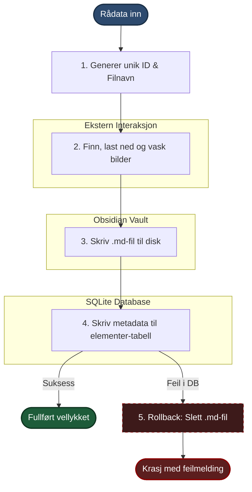

# Dokumentasjon: `vault_skriver.py`

Denne modulen sørger for atomisk lagring av artikler til en Obsidian-vault og en SQLite-database. Alle innhentingskanaler — RSS, nett, YouTube og manuell klipping — bruker samme modul for å sikre konsistent datastruktur på tvers av filsystem og database.

---

## Prosessflyt (Atomisk Skrivesekvens)

Dette diagrammet viser hvordan en artikkel blir behandlet fra den kommer inn som rådata til den er trygt lagret.



---

## Offentlig API: `lagre_artikkel()`

Dette er modulens eneste eksponerte funksjon. Den orkestrerer hele sekvensen og er det eneste kallpunktet for alle innhentingskanaler.

**Signatur:**

```python
lagre_artikkel(
    kilde_id: int,
    url: str,
    tittel: str,
    innhold: str,
    publisert: str | None,
    kildetype: str,
    db_sti: Path,
    vault_rot: Path,
    klippet_dato: str | None = None,
    kilde_mappe: str | None = None,
) -> str  # returnerer element_id som UUID4-streng
```

**Nøkkelatferd:**

- Genererer en UUID4 + 8-tegns kortversjon som brukes i filnavnet (`d4f6a8b2-min-tittel.md`).
- Hvis `kilde_mappe` er satt, legges artikkelen i `artikler/{kilde_mappe}/` og bildeprefiks justeres tilsvarende (`../../ressurser/bilder`).
- Hvis `publisert` er `None`, brukes `klippet_dato` som fallback — nyttig for manuelt klippede artikler.
- Feiler SQLite-skriving etter at `.md`-filen er skrevet, slettes filen og unntaket re-raises. Ingen halvferdige tilstander.

---

## Funksjonsoversikt

| Funksjon | Ansvarsområde | Beskrivelse |
|---|---|---|
| `lagre_artikkel` | Orkestrator (API) | Eneste offentlige funksjon. Styrer hele sekvensen og håndterer rollback. |
| `_lag_slug` | Tekstvask | Gjør om tittelen til en URL-sikker streng for filnavn. |
| `_bygg_markdown` | Formatering | Genererer YAML-frontmatter og setter inn innholdet i en MD-mal. |
| `_behandle_bilder` | Bildehåndtering | Skanner tekst etter bilde-URL-er og koordinerer nedlasting. |
| `_last_ned_bilde` | Nettverk | Utfører selve HTTP-hentingen og lagrer bildet binært på disk. |
| `_finn_ext` | Filtype-detektiv | Analyserer MIME-type og URL for å finne riktig filendelse. |
| `_skriv_til_db` | Database | Utfører SQL INSERT og aktiverer Foreign Keys via PRAGMA. |

---

## Interne hjelpefunksjoner

### `_lag_slug(tittel)`

Bruker NFKD-normalisering for å konvertere sammensatte tegn (f.eks. `å → a`, `ø → o`) til ASCII der det er mulig. Tegn som ikke kan mappes, fjernes stille. Resultatet er lowercase med kun `a-z`, `0-9` og bindestreker. Tom streng returnerer fallback `"artikkel"`.

```
"Hva er generativ AI?" → "hva-er-generativ-ai"
```

### `_bygg_markdown()`

Genererer YAML-frontmatter med disse feltene:

```yaml
---
element_id: <UUID4>
url: <artikkelens URL>
kildetype: rss | manuell | nett | youtube
klippet_dato: <ISO-dato>   # kun hvis manuell klipping
publisert: <ISO-dato>      # utelates hvis None
---
```

`klippet_dato` og `publisert` skrives bare hvis de har verdi — ingen tomme felter i frontmatter.

### `_behandle_bilder()`

Finner bilder i to formater:

- Markdown: ``
- HTML: ``

For hver unik bilde-URL: løs relative URL-er mot artikkelens `base_url` med `urljoin`, kall `_last_ned_bilde`, erstatt original-URL med lokal sti i innholdet. Ugyldig URL eller HTTP-feil → logg `WARNING`, behold original-URL, fortsett.

### `_last_ned_bilde()`

Bruker `httpx` med `follow_redirects=True` og 10 sekunders timeout. Lagrer bildet binært med et nytt UUID8-filnavn (`{uuid8}.{ext}`). Returnerer relativ sti fra artikkelmappe til bildet, eller `None` ved feil.

### `_finn_ext()`

Prioriteringsrekkefølge for filendelse:

1. `Content-Type`-header (støtter `jpeg`, `png`, `gif`, `webp`, `svg+xml`)
2. URL-suffix som fallback
3. `"bin"` hvis ingenting matcher

`jpeg` normaliseres alltid til `jpg`.

### `_skriv_til_db()`

Åpner SQLite-tilkobling med kontekstmanager (`with sqlite3.connect(...)`), aktiverer `PRAGMA foreign_keys = ON` og utfører INSERT i `elementer`-tabellen. Foreign key-sjekken sikrer at `kilde_id` peker på en gyldig kilde.

---

## Fil- og Datastruktur

### Fysisk lagring i Vault

```
vault_rot/
├── artikler/                        <-- Artikler uten kilde_mappe
│   ├── d4f6a8b2-min-tittel.md
│   └── [kilde_mappe]/               <-- Valgfri undermappe per kilde
│       └── c1a3e5f7-annen-tittel.md
└── ressurser/
    └── bilder/                      <-- Sentralt bildearkiv for alle artikler
        ├── d4f6a8b2.jpg             <-- Navngitt med UUID8 for unikhet
        └── c1a3e5g7.png
```

Bildeprefiks i `.md`-filer justeres automatisk basert på mappenivå:

- Uten `kilde_mappe`: `../ressurser/bilder`
- Med `kilde_mappe`: `../../ressurser/bilder`

### Metadata i SQLite (tabell: `elementer`)

| Kolonne | Type | Beskrivelse |
|---|---|---|
| `kilde_id` | int | FK til `kilder`-tabellen |
| `guid` | text | Fullstendig UUID4 (unik nøkkel) |
| `url` | text | Artikkelen sin kanoniske URL |
| `tittel` | text | Artikkeltittel |
| `publisert` | text | ISO-dato fra kilden, eller `klippet_dato` som fallback |
| `hentet` | text | ISO-datetime (UTC) for når artikkelen ble lagret lokalt |
| `vault_sti` | text | Relativ sti til `.md`-filen, f.eks. `artikler/kilde/d4f6a8b2-slug.md` |
| `bilder_json` | text | JSON-liste med filnavn for nedlastede bilder, eller `NULL` |

---

*Dokumentasjon generert for internt bruk.*
